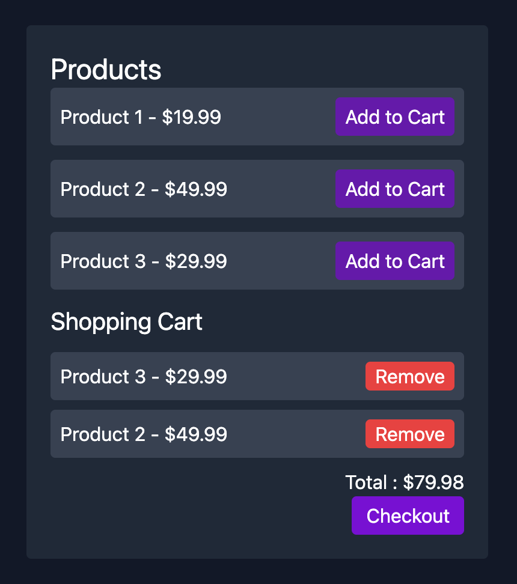

# Shopping Cart

A simple shopping cart web application built with HTML, JavaScript, and Tailwind CSS.

## Features

- Displays a list of products with prices.
- Allows users to add products to a shopping cart.
- Shows the cart contents and total price.
- Checkout button to clear the cart.

## Getting Started

1. **Clone or download this repository.**
2. **Open `index.html` in your browser.**

No build steps or dependencies are required.

## Project Structure

```
index.html      # Main HTML file with Tailwind CSS and script reference
script.js       # JavaScript logic for products and cart
README.md       # Project documentation
```

## Usage

- Click "Add to Cart" to add a product.
- The cart updates with selected items and total price.
- Click "Checkout" to clear the cart.

## Customization

- To add more products, edit the `products` array in [`script.js`](script.js).
- Styling is handled by [Tailwind CSS](https://tailwindcss.com/).

## Screenshot



---

© 2024 Your Name
